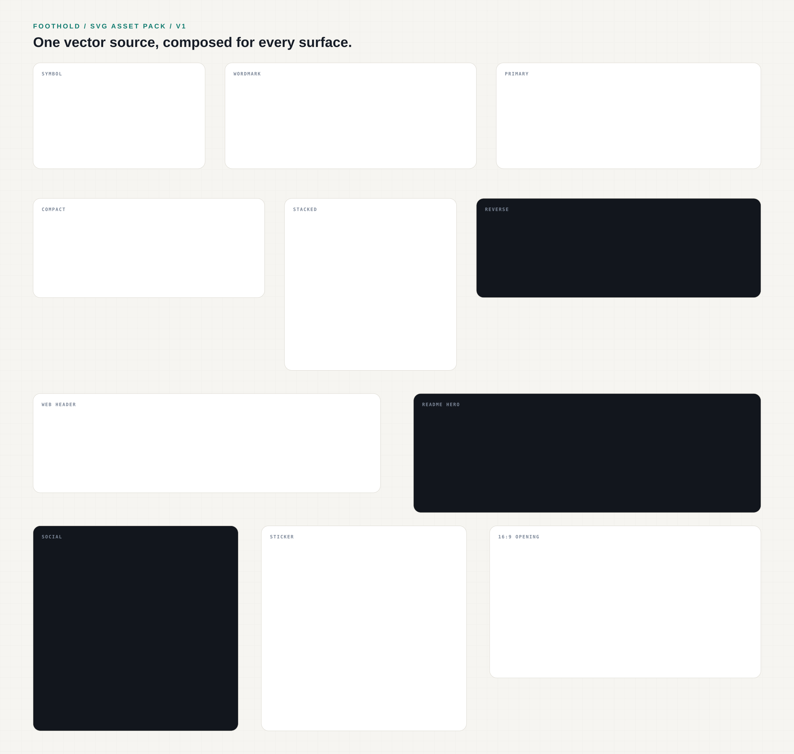

# FOOTHOLD Brand System

[한국어](./README.ko.md) · English



FOOTHOLD is the shared visual and verbal system for a terrain-adaptive quadruped locomotion project. This repository is the canonical source for brand tokens, approved logo geometry, messaging, the ratio-independent Visual Master Board, and reusable delivery assets.

> Find the next foothold.

**TARGET VISION** — `시뮬레이터에서 천 번 넘어지고, 현장에서는 넘어지지 않는다.` This is the intended Sim-to-Real outcome, not a verified zero-fall field result.

## Current status

- `v1.0.2`: approved logo geometry with SVG sources and reproducible PNG derivatives, including the Compact spacing correction
- `v1.1.0`: public, cross-platform foundation and local Figma synchronization infrastructure
- `v1.2.0`: approved six-medium OSMU baseline; project-specific M03–M09 evidence remains progressively gated

The v1.1 implementation intentionally does not invent robot imagery, metrics, team roles, deployment claims, or roadmap facts that have not been verified.

## Source of truth

| Decision | Canonical source |
|---|---|
| Token values | [`tokens/foothold.tokens.json`](./tokens/foothold.tokens.json) |
| Approved logo geometry | [`assets/logo/v1`](./assets/logo/v1/) canonical SVG paths |
| Approved wording | [`VOICE_AND_MESSAGE.md`](./VOICE_AND_MESSAGE.md) |
| Brand rules | [`BRAND_BIBLE.md`](./BRAND_BIBLE.md) |
| Module structure | [`MASTER_BOARD_SPEC.md`](./MASTER_BOARD_SPEC.md) |
| Project-content evidence | [`content/master-board-evidence.json`](./content/master-board-evidence.json) |
| Visual composition proposals | Figma Master Board, promoted only after review |

Figma is an editable visual workspace, not a second token or logo source. A Figma-only change remains a proposal until it is exported, reviewed, and promoted to this repository.

## Repository map

```text
assets/          approved logo and OSMU SVG sources, reproducible PNG/JPG derivatives, and delivery exports
concepts/        review history; never use as production assets
content/         machine-readable evidence gates for project-specific claims
figma/           mappings, Master Board specification, local plugin
templates/       OSMU templates as they are approved
tokens/          canonical DTCG JSON and generated CSS
scripts/         deterministic cross-platform validation
docs/            governance, source-of-truth, and roadmap
```

## Quick checks

Node.js 20.9 or newer is required.

```bash
npm run generate
npm test
```

The committed generated files must remain byte-for-byte current after `npm run generate`.

## Ready-to-use asset packs

- [`FOOTHOLD_SVG_ASSET_PACK_V1.zip`](./assets/FOOTHOLD_SVG_ASSET_PACK_V1.zip): SVG-only vector package.
- [`FOOTHOLD_ASSET_PACK_V1.zip`](./assets/FOOTHOLD_ASSET_PACK_V1.zip): combined SVG + PNG + background-filled JPG package.
- [`FOOTHOLD_OSMU_V1_2.zip`](./assets/FOOTHOLD_OSMU_V1_2.zip): current approved Web, GitHub, presentation, poster, social, and sticker SVG/PNG/JPG assets.
- [`assets/osmu/v1.2/manifest.json`](./assets/osmu/v1.2/manifest.json): approval provenance, dimensions, lifecycle, and hashes for the current OSMU baseline.
- [`assets/raster/v1/manifest.json`](./assets/raster/v1/manifest.json): source mapping, pixel dimensions, alpha policy, status, and hashes for every PNG derivative.
- [`assets/raster/v1/jpeg/manifest.json`](./assets/raster/v1/jpeg/manifest.json): lifecycle, exact canvas, background, and hashes for every JPG derivative.

SVG remains canonical. PNG logo files keep a transparent RGBA canvas. JPG companions flatten that same canvas onto exact brand paper `#F6F5F1` or engineering dark `#12161D`, without added padding; favicon is intentionally excluded. Legacy, retired, and provisional outputs remain in separate lifecycle directories and must not be mistaken for approved OSMU templates.

Current approved OSMU sources live only in [`assets/osmu/v1.2`](./assets/osmu/v1.2/). Files under `assets/exports/v1` and their raster companions are preserved legacy composition proofs, not the approved current designs.

## Figma workflow

The local plugin does not consume Figma MCP calls and does not require a Professional plan. Use the Figma desktop app, create a development plugin once to obtain a plugin ID, then follow [`figma/plugin/README.md`](./figma/plugin/README.md).

```text
Git canonical source
  -> local Figma plugin sync
  -> visual edit and approval
  -> JSON + SVG + PNG handoff
  -> Codex diff and human approval
  -> Git promotion and regeneration
```

## Licensing

This is a mixed-license repository. Code and token sources use MIT; eligible brand documentation uses CC BY 4.0; FOOTHOLD names, logos, and designated brand assets are excluded from those grants. Read [`LICENSE.md`](./LICENSE.md), [`LICENSE_SCOPE.md`](./LICENSE_SCOPE.md), and [`TRADEMARKS.md`](./TRADEMARKS.md) before reuse.
